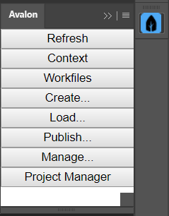
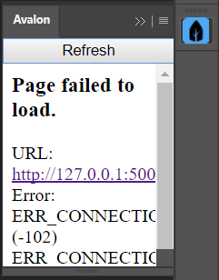

# Photoshop Integration

`NOTE: This integration is only tested on Windows.`

This integration requires the third part library `pywin32` which can be installed with:

```
pip install pywin32
```

## Setup

The Photoshop integration requires two components to work; `extension` and `server`.

### Extension

To install the extension download [Extension Manager Command Line tool (ExManCmd)](https://github.com/Adobe-CEP/Getting-Started-guides/tree/master/Package%20Distribute%20Install#option-2---exmancmd).

```
ExManCmd /install {path to avalon-core}\avalon\photoshop\extension.zxp
```

### Server

The easiest way to get the server and Photoshop launch is with:

```
python -c ^"import avalon.photoshop;avalon.photoshop.launch(""C:\Program Files\Adobe\Adobe Photoshop 2020\Photoshop.exe"")^"
```

`avalon.photoshop.launch` launches the application and server, and also closes the server when Photoshop exists.

You can also run the server separately with:

```
python -c "from avalon.tools import html_server;html_server.app.start_server(5000)"
```

## Usage

The Photoshop extension can be found under `Window > Extensions > Avalon`. Once launched you should be presented with a panel like this:



If the server is not running you will get a page failure:



Start the server and hit `Refresh`.

## Developing

### Extension
When developing the extension you can load it [unsigned](https://github.com/Adobe-CEP/CEP-Resources/blob/master/CEP_9.x/Documentation/CEP%209.0%20HTML%20Extension%20Cookbook.md#debugging-unsigned-extensions).

When signing the extension you can use this [guide](https://github.com/Adobe-CEP/Getting-Started-guides/tree/master/Package%20Distribute%20Install#package-distribute-install-guide).

```
ZXPSignCmd -selfSignedCert NA NA Avalon Avalon-Photoshop avalon extension.p12
ZXPSignCmd -sign {path to avalon-core}\avalon\photoshop\extension {path to avalon-core}\avalon\photoshop\extension.zxp extension.p12 avalon
```

### Plugin Examples

These plugins were made with the [polly config](https://github.com/mindbender-studio/config). To fully integrate and load, you will have to use this config and add `image` to the [integration plugin](https://github.com/mindbender-studio/config/blob/master/polly/plugins/publish/integrate_asset.py).

#### Creator Plugin
```python
from avalon import photoshop


class CreateImage(photoshop.Creator):
    """Image folder for publish."""

    name = "imageDefault"
    label = "Image"
    family = "image"

    def __init__(self, *args, **kwargs):
        super(CreateImage, self).__init__(*args, **kwargs)
```

#### Collector Plugin
```python
import pythoncom

from avalon import photoshop

import pyblish.api


class CollectInstances(pyblish.api.ContextPlugin):
    """Gather instances by LayerSet and file metadata

    This collector takes into account assets that are associated with
    an LayerSet and marked with a unique identifier;

    Identifier:
        id (str): "pyblish.avalon.instance"
    """

    label = "Instances"
    order = pyblish.api.CollectorOrder
    hosts = ["photoshop"]

    def process(self, context):
        # Necessary call when running in a different thread which pyblish-qml
        # can be.
        pythoncom.CoInitialize()

        for layer in photoshop.get_layers_in_document():
            layer_data = photoshop.read(layer)

            # Skip layers without metadata.
            if layer_data is None:
                continue

            # Skip containers.
            if "container" in layer_data["id"]:
                continue

            child_layers = [*layer.Layers]
            if not child_layers:
                self.log.info("%s skipped, it was empty." % layer.Name)
                continue

            instance = context.create_instance(layer.Name)
            instance.append(layer)
            instance.data.update(layer_data)

            # Produce diagnostic message for any graphical
            # user interface interested in visualising it.
            self.log.info("Found: \"%s\" " % instance.data["name"])
```

#### Extractor Plugin
```python
import os

import pyblish.api
from avalon import photoshop, Session


class ExtractImage(pyblish.api.InstancePlugin):
    """Produce a flattened image file from instance

    This plug-in takes into account only the layers in the group.
    """

    label = "Extract Image"
    order = pyblish.api.ExtractorOrder
    hosts = ["photoshop"]
    families = ["image"]

    def process(self, instance):

        dirname = os.path.join(
            os.path.normpath(
                Session["AVALON_WORKDIR"]
            ).replace("\\", "/"),
            instance.data["name"]
        )

        try:
            os.makedirs(dirname)
        except OSError:
            pass

        # Store reference for integration
        if "files" not in instance.data:
            instance.data["files"] = list()

        path = os.path.join(dirname, instance.data["name"])

        # Perform extraction
        with photoshop.maintained_selection():
            self.log.info("Extracting %s" % str(list(instance)))
            with photoshop.maintained_visibility():
                # Hide all other layers.
                extract_ids = [
                    x.id for x in photoshop.get_layers_in_layers([instance[0]])
                ]
                for layer in photoshop.get_layers_in_document():
                    if layer.id not in extract_ids:
                        layer.Visible = False

                save_options = {
                    "png": photoshop.com_objects.PNGSaveOptions(),
                    "jpg": photoshop.com_objects.JPEGSaveOptions()
                }

                for extension, save_option in save_options.items():
                    photoshop.app().ActiveDocument.SaveAs(
                        path, save_option, True
                    )
                    instance.data["files"].append(
                        "{}.{}".format(path, extension)
                    )

        instance.data["stagingDir"] = dirname

        self.log.info("Extracted {instance} to {path}".format(**locals()))
```

#### Loader Plugin
```python
from avalon import api, photoshop


class ImageLoader(api.Loader):
    """Load images

    Stores the imported asset in a container named after the asset.
    """

    families = ["image"]
    representations = ["*"]

    def load(self, context, name=None, namespace=None, data=None):
        with photoshop.maintained_selection():
            layer = photoshop.import_smart_object(self.fname)

        self[:] = [layer]

        return photoshop.containerise(
            name,
            namespace,
            layer,
            context,
            self.__class__.__name__
        )

    def update(self, container, representation):
        layer = container.pop("layer")

        with photoshop.maintained_selection():
            photoshop.replace_smart_object(
                layer, api.get_representation_path(representation)
            )

        photoshop.imprint(
            layer, {"representation": str(representation["_id"])}
        )

    def remove(self, container):
        container["layer"].Delete()

    def switch(self, container, representation):
        self.update(container, representation)
```

## Resources
  - https://github.com/lohriialo/photoshop-scripting-python
  - https://www.adobe.com/devnet/photoshop/scripting.html
  - https://github.com/Adobe-CEP/Getting-Started-guides
  - https://github.com/Adobe-CEP/CEP-Resources
